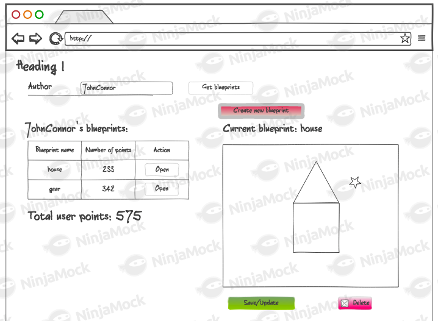
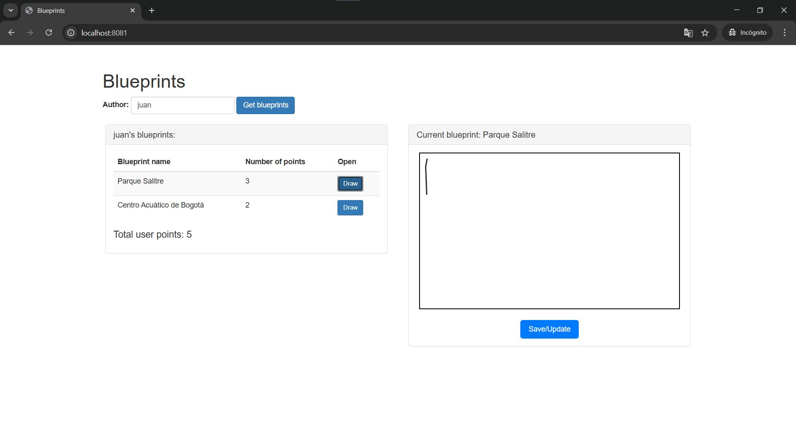
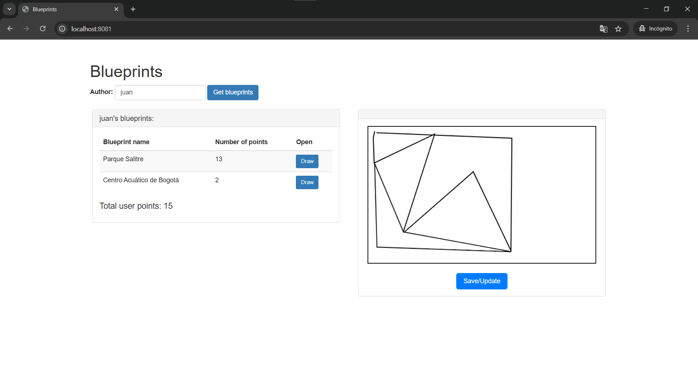
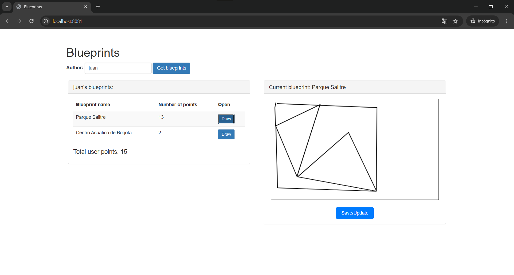
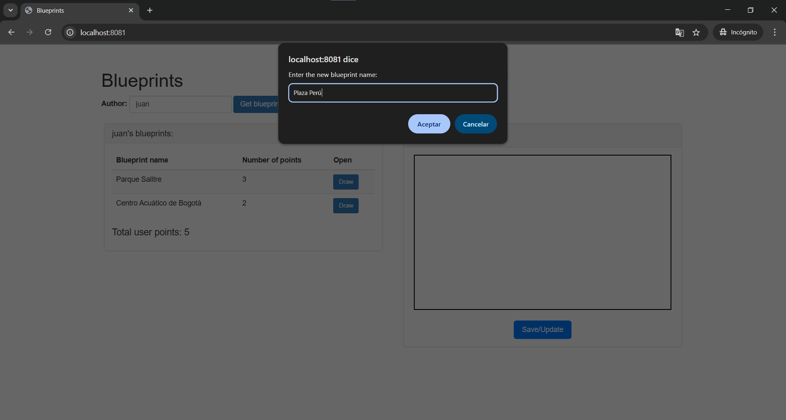
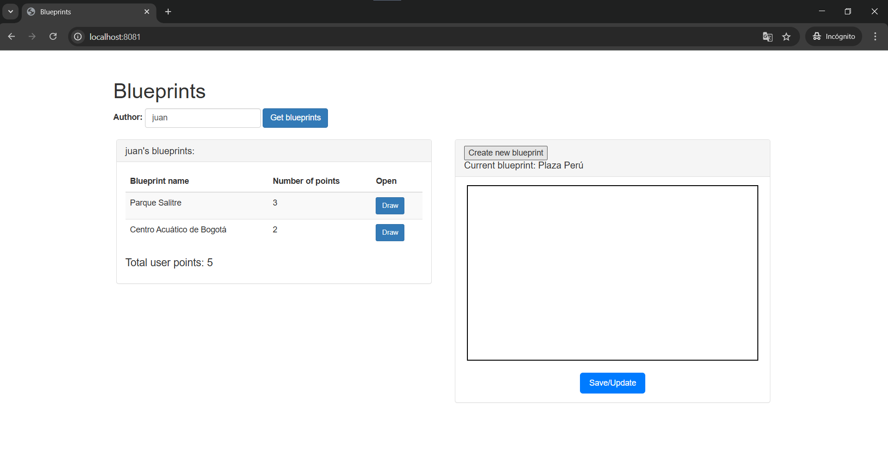
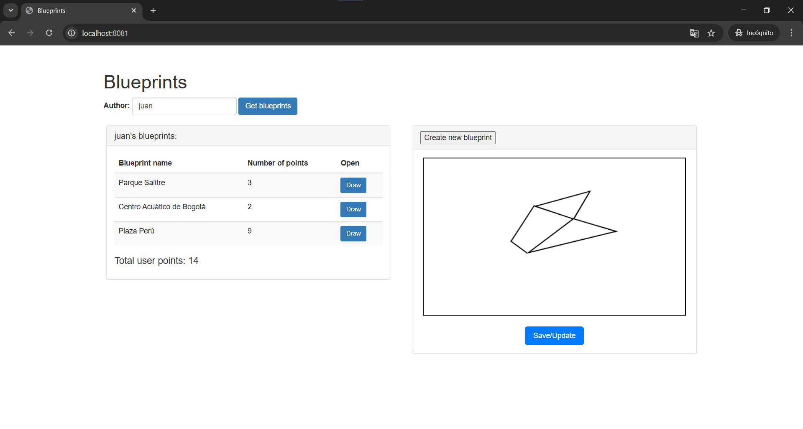
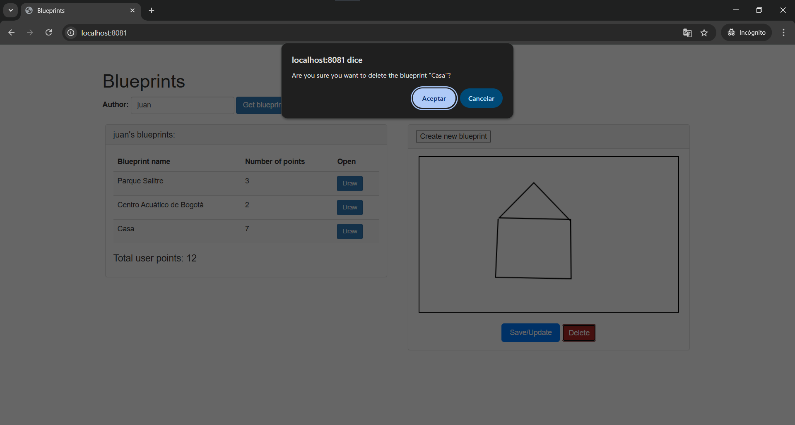
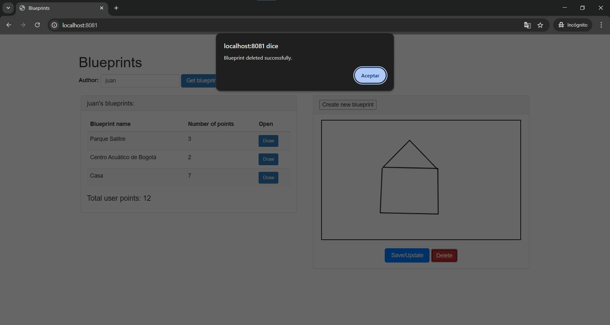
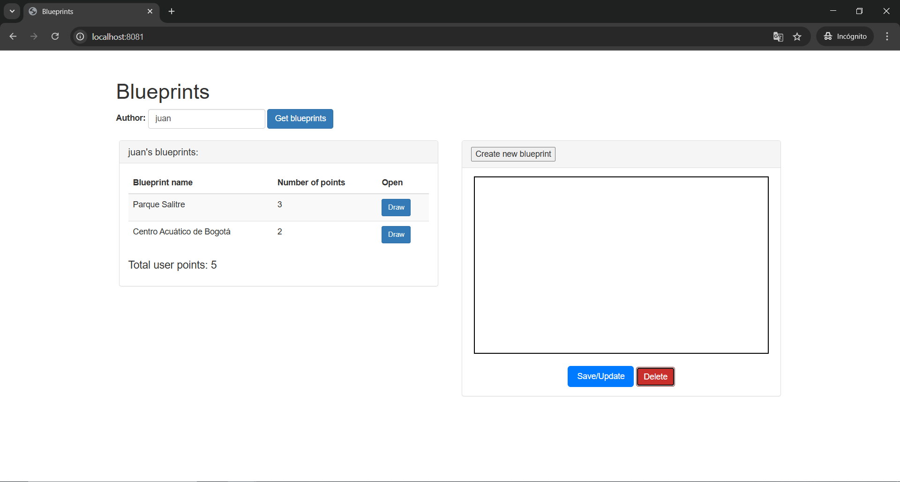

### Escuela Colombiana de Ingeniería

### Arquitecturas de Software - ARSW

---

### Integrantes

- Sergio Andrés Bejarano Rodríguez
- Laura Daniela Rodríguez Sánchez

---

#### Construción de un cliente 'grueso' con un API REST, HTML5, Javascript y CSS3. Parte II.



*1. Agregue al canvas de la página un manejador de eventos que permita capturar los 'clicks' realizados, bien sea a través del mouse, o a través de una pantalla táctil. Para esto, tenga en cuenta [este ejemplo de uso de los eventos de tipo 'PointerEvent'](https://mobiforge.com/design-development/html5-pointer-events-api-combining-touch-mouse-and-pen) (aún no soportado por todos los navegadores) para este fin. Recuerde que a diferencia del ejemplo anterior (donde el código JS está incrustado en la vista), se espera tener la inicialización de los manejadores de eventos correctamente modularizado, tal [como se muestra en este codepen](https://codepen.io/hcadavid/pen/BwWbrw).*

Se implementó un sistema de captura de eventos de click y touch en el canvas de manera modularizada en el archivo `src/main/resources/static/js/app.js`. La implementación incluye:

#### Variables de estado añadidas:

```javascript
var currentBlueprint = null; // { author, name, points: [ {x,y}, ... ] }
var canvasEl = null;
var ctx = null;
```

#### Función para obtener coordenadas del canvas:

```javascript
function getCanvasPoint(evt) {
  var rect = canvasEl.getBoundingClientRect();
  var clientX, clientY;
  if (evt.touches && evt.touches.length > 0) {
    clientX = evt.touches[0].clientX;
    clientY = evt.touches[0].clientY;
  } else if (evt.changedTouches && evt.changedTouches.length > 0) {
    clientX = evt.changedTouches[0].clientX;
    clientY = evt.changedTouches[0].clientY;
  } else {
    clientX = evt.clientX;
    clientY = evt.clientY;
  }
  var x = clientX - rect.left;
  var y = clientY - rect.top;
  return { x: x, y: y };
}
```

#### Manejadores de eventos en la función `init()`:

```javascript
// Evento para clicks del mouse
canvasEl.addEventListener("click", function (evt) {
  if (!currentBlueprint) return;
  var p = getCanvasPoint(evt);
  currentBlueprint.points.push({ x: p.x, y: p.y });
  app.repaint();
});

// Evento para pantallas táctiles
canvasEl.addEventListener(
  "touchstart",
  function (evt) {
    evt.preventDefault();
    if (!currentBlueprint) return;
    var p = getCanvasPoint(evt);
    currentBlueprint.points.push({ x: p.x, y: p.y });
    app.repaint();
  },
  { passive: false }
);
```

*2. Agregue lo que haga falta en sus módulos para que cuando se capturen nuevos puntos en el canvas abierto (si no se ha seleccionado un canvas NO se debe hacer nada):*

   1. Se agregue el punto al final de la secuencia de puntos del canvas actual (sólo en la memoria de la aplicación, AÚN NO EN EL API!).
   2. Se repinte el dibujo.

#### Función `drawBlueprint()` modificada:

Se modificó para cargar el blueprint seleccionado en memoria y permitir la edición:

```javascript
drawBlueprint: function(author, bpname) {
    console.log(`Dibujando blueprint: ${bpname} de ${author}`);

    api.getBlueprintsByNameAndAuthor(author, bpname, function (blueprint) {
        if (!blueprint) {
            console.log("No se encontró el blueprint.");
            $("#blueprint-title").text("No blueprint found: " + bpname);
            return;
        }

        currentBlueprint = {
            author: blueprint.author || author,
            name: blueprint.name || bpname,
            points: Array.isArray(blueprint.points) ? blueprint.points.slice() : []
        };

        $("#blueprint-title").text(`Current blueprint: ${currentBlueprint.name}`);

        if (!canvasEl) {
            canvasEl = document.getElementById("myCanvas");
            if (!canvasEl) {
                console.error("Canvas 'myCanvas' no encontrado en el DOM.");
                return;
            }
            ctx = canvasEl.getContext("2d");
        }

        // Dibujar el blueprint desde la memoria
        app.repaint();
    });
}
```

#### Función `repaint()` implementada:

```javascript
repaint: function() {
    if (!currentBlueprint || !canvasEl || !ctx) return;

    // Limpiar canvas
    ctx.clearRect(0, 0, canvasEl.width, canvasEl.height);

    var pts = currentBlueprint.points;
    if (!pts || pts.length === 0) return;

    // Dibujar líneas conectando los puntos
    ctx.beginPath();
    ctx.lineWidth = 2;
    ctx.strokeStyle = "#000";
    ctx.moveTo(pts[0].x, pts[0].y);
    for (var i = 1; i < pts.length; i++) {
        ctx.lineTo(pts[i].x, pts[i].y);
    }
    ctx.stroke();
}
```

### Características implementadas:

- **Modularización**: El código está correctamente organizado dentro del módulo `app` y se inicializa en la función `init()`.

- **Compatibilidad multi-dispositivo**: Soporte tanto para eventos de mouse (`click`) como para pantallas táctiles (`touchstart`).

- **Gestión de estado**: Solo permite agregar puntos cuando hay un blueprint abierto (`currentBlueprint` no es null).

- **Cálculo de coordenadas**: Conversión precisa de coordenadas del evento a coordenadas del canvas usando `getBoundingClientRect()`.

- **Actualización en tiempo real**: Los puntos se agregan inmediatamente a la memoria y el canvas se repinta automáticamente.

*3.&nbsp; Agregue el botón Save/Update. Respetando la arquitectura de módulos actual del cliente, haga que al oprimirse el botón:*

1.  Se haga PUT al API, con el plano actualizado, en su recurso REST correspondiente.
2.  Se haga GET al recurso /blueprints, para obtener de nuevo todos los planos realizados.
3.  Se calculen nuevamente los puntos totales del usuario.

Para lo anterior tenga en cuenta:

- jQuery no tiene funciones para peticiones PUT o DELETE, por lo que es necesario 'configurarlas' manualmente a través de su API para AJAX. Por ejemplo, para hacer una peticion PUT a un recurso /myrecurso:

```javascript
return $.ajax({
  url: "/mirecurso",
  type: "PUT",
  data: '{"prop1":1000,"prop2":"papas"}',
  contentType: "application/json",
});
```

Para éste note que la propiedad 'data' del objeto enviado a $.ajax debe ser un objeto jSON (en formato de texto). Si el dato que quiere enviar es un objeto JavaScript, puede convertirlo a jSON con:

```javascript
JSON.stringify(objetojavascript),
```

- Como en este caso se tienen tres operaciones basadas en _callbacks_, y que las mismas requieren realizarse en un orden específico, tenga en cuenta cómo usar las promesas de JavaScript [mediante alguno de los ejemplos disponibles](http://codepen.io/hcadavid/pen/jrwdgK).

En el archivo `index.html` agregamos el siguiente código para agregar el botón:

````html
<div class="btn-container">
    <button id="btn-save-blueprints">Save/Update</button>
</div>
````

Dentro de `app.js` creamos la función `saveOrUpdateBlueprint` para implementar el
llamado al método PUT y realizar el GET del listado de planos a través de promesas.

````javascript
var isNewBlueprint = false;

saveOrUpdateBlueprint: function() {
    if (!selectedAuthor) {
        console.log("No hay un autor seleccionado para guardar.");
        alert("Please select an author before saving.");
        return;
    }

    if (!currentBlueprint || !currentBlueprint.name) {
        let newName = prompt("Enter the new blueprint name:");
        if (!newName || newName.trim() === "") {
            console.log("No se proporcionó un nombre de blueprint válido.");
            alert("Invalid blueprint name.");
            return;
        }
        currentBlueprint = {
            author: selectedAuthor,
            name: newName.trim(),
            points: currentBlueprint?.points || []
        };
        isNewBlueprint = true;
        $("#blueprint-title").text(`Current blueprint: ${currentBlueprint.name}`);
        alert(`New blueprint created: ${currentBlueprint.name}`);
    }

    if (!Array.isArray(currentBlueprint.points)) {
        currentBlueprint.points = [];
    }

    let blueprintData = {
        author: selectedAuthor,
        name: currentBlueprint.name,
        points: currentBlueprint.points
    };

    console.log("Guardando blueprint:", blueprintData);

    let url, requestType;

    if (isNewBlueprint) {
        url = `http://localhost:8081/blueprints`;
        requestType = "POST";
    } else {
        url = `http://localhost:8081/blueprints/${selectedAuthor}/${currentBlueprint.name}`;
        requestType = "PUT";
    }

    $.ajax({
        url: url,
        type: requestType,
        data: JSON.stringify(blueprintData),
        contentType: "application/json"
    })
        .then(() => {
            console.log("Blueprint guardado correctamente.");
            alert("Blueprint saved successfully.");
            return $.get(`http://localhost:8081/blueprints/${selectedAuthor}`);
        })
        .then(() => {
            app.updateBlueprintsList(selectedAuthor);
            isNewBlueprint = false;
        })
        .catch((error) => {
            console.error("Error al guardar el blueprint:", error);
            alert("An error occurred while saving the blueprint.");
        });
},
````

En el mismo archivo, modificamos la función `init` para que incluya:

````javascript
$("#btn-save-blueprints").click(function() {
    app.saveOrUpdateBlueprint();
});
````

Para probar su correcto funcionamiento cargamos el plano `Parque Salitre` del autor `juan`:



Agreamos nuevos puntos y guardamos. Podemos verificar que el número de puntos se actualizó correctamente.



Volvemos a dibujar el plano para verificar que se haya actualizado correctamente.



*4. Agregue el botón 'Create new blueprint', de manera que cuando se oprima:*

   - Se borre el canvas actual.
   - Se solicite el nombre del nuevo 'blueprint' (usted decide la manera de hacerlo).

   Esta opción debe cambiar la manera como funciona la opción 'save/update', pues en este caso, al oprimirse la primera vez debe (igualmente, usando promesas):

   1. Hacer POST al recurso /blueprints, para crear el nuevo plano.
   2. Hacer GET a este mismo recurso, para actualizar el listado de planos y el puntaje del usuario.

En el archivo `index.html` agregamos el botón.

````html
<button id="btn-new-blueprint">Create new blueprint</button>
````
En el archivo `app.js`, en la función `init` se agrega:

````javascript
$("#btn-new-blueprint").click(function() {
    app.createNewBlueprint();
});
````

En el mismo archivo se crea e implementa la función `createNewBlueprint`.

````javascript
createNewBlueprint: function() {
    if (!selectedAuthor) {
        alert("Please select an author before creating a new blueprint.");
        console.log("Debe seleccionar un autor antes de crear un nuevo blueprint.");
        return;
    }

    let blueprintName = prompt("Enter the new blueprint name:");

    if (!blueprintName || blueprintName.trim() === "") {
        alert("Invalid blueprint name.");
        console.log("Nombre de blueprint inválido.");
        return;
    }

    if (!canvasEl) {
        canvasEl = document.getElementById("myCanvas");
        if (!canvasEl) {
            console.error("Canvas 'myCanvas' no encontrado.");
            return;
        }
        ctx = canvasEl.getContext("2d");
    }

    ctx.clearRect(0, 0, canvasEl.width, canvasEl.height);

    currentBlueprint = {
        author: selectedAuthor,
        name: blueprintName.trim(),
        points: []
    };
    isNewBlueprint = true;

    $("#blueprint-title").text(`Current blueprint: ${currentBlueprint.name}`);
    alert(`New blueprint created: ${currentBlueprint.name}`);
    console.log("Nuevo blueprint creado:", currentBlueprint);
},
````
Para probar la funcionalidad creamos un nuevo plano llamado `Plaza Perú`.



Vemos que se creó correctamente y tenemos nuestro canvas en blanco y listo para agregar puntos. 



Al salvar el plano observamos que se agrega a la lista de planos del usuario



*5. Agregue el botón 'DELETE', de manera que (también con promesas):*
   - Borre el canvas.
   - Haga DELETE del recurso correspondiente.
   - Haga GET de los planos ahora disponibles.

Primero creamos el endpoint en `BlueprintAPIController`.

````java
    /**
     * Deletes a blueprint by its author and name.
     * Handles HTTP DELETE requests to remove a specific blueprint.
     *
     * @param author The name of the blueprint's author.
     * @param bpname The name of the blueprint.
     * @return a ResponseEntity with the status of the delete operation.
     */
    @DeleteMapping(value = "/{author}/{bpname}")
    public ResponseEntity<?> deleteBlueprint(@PathVariable("author") String author, @PathVariable("bpname") String bpname) {
        try {
            blueprintsServices.deleteBlueprint(author, bpname);
            return new ResponseEntity<>(HttpStatus.NO_CONTENT); // 204: No Content
        } catch (BlueprintNotFoundException e) {
            return new ResponseEntity<>("The blueprint does not exist", HttpStatus.NOT_FOUND);
        } catch (Exception e) {
            return new ResponseEntity<>("Error updating the blueprint", HttpStatus.INTERNAL_SERVER_ERROR);
        }
    }
````

En `BlueprintsServices`:

````java
    /**
     * Deletes a blueprint by its author and name.
     * Calls the persistence layer to remove the blueprint.
     *
     * @param author The name of the blueprint's author.
     * @param name The name of the blueprint.
     * @throws BlueprintNotFoundException If the blueprint does not exist.
     */
    public void deleteBlueprint(String author, String name) throws BlueprintNotFoundException {
        bpp.deleteBlueprint(author, name);
    }
````

En `BlueprintsPersistence`:

````java
    /**
     * Deletes a blueprint by its author and name.
     * Removes the blueprint from storage if it exists.
     *
     * @param author The name of the blueprint's author.
     * @param name The name of the blueprint.
     * @throws BlueprintNotFoundException If the blueprint does not exist.
     */
    public void deleteBlueprint(String author, String name) throws BlueprintNotFoundException;
````
En `InMemoryBlueprintPersistence`:

````java
    /**
     * Deletes a blueprint by its author and name.
     * If the blueprint does not exist, an exception is thrown.
     *
     * @param author The name of the blueprint's author.
     * @param name The name of the blueprint.
     * @throws BlueprintNotFoundException If the blueprint is not found.
     */
    @Override
    public void deleteBlueprint(String author, String name) throws BlueprintNotFoundException {
        Tuple<String, String> key = new Tuple<>(author, name);

        if (!blueprints.containsKey(key)) {
            throw new BlueprintNotFoundException("The blueprint does not exist: " + name);
        }

        blueprints.remove(key);
        System.out.println("Plane successfully deleted: " + name + " from " + author);
    }
````

Ahora, en `index.html` agregamos el botón:

````html
<button id="btn-delete-blueprint" class="btn btn-danger">Delete</button>
````

En `app.js`, en la función `init` agregamos:

````javascript
// Asociar con deleteBlueprint
$("#btn-delete-blueprint").click(function() {
    app.deleteBlueprint();
});
````

En el mismo archivo implementamos la función `deleteBlueprint`.

````javascript
deleteBlueprint: function() {
    if (!selectedAuthor || !currentBlueprint || !currentBlueprint.name) {
        console.log("No hay un blueprint seleccionado para eliminar.");
        alert("Please select a blueprint before deleting.");
        return;
    }

    let confirmDelete = confirm(`Are you sure you want to delete the blueprint "${currentBlueprint.name}"?`);
    if (!confirmDelete) return;

    let url = `http://localhost:8081/blueprints/${selectedAuthor}/${currentBlueprint.name}`;

    $.ajax({
        url: url,
        type: "DELETE",
        contentType: "application/json"
    })
        .then(() => {
            console.log("Blueprint eliminado correctamente.");
            alert("Blueprint deleted successfully.");

            currentBlueprint = null;

            if (canvasEl && ctx) {
                ctx.clearRect(0, 0, canvasEl.width, canvasEl.height);
            }

            $("#blueprint-title").text("Current blueprint: none");

            return $.get(`http://localhost:8081/blueprints/${selectedAuthor}`);
        })
        .then(() => {
            app.updateBlueprintsList(selectedAuthor);
        })
        .catch((error) => {
            console.error("Error al eliminar el blueprint:", error);
            alert("An error occurred while deleting the blueprint.");
        });
},
````
En un plano creado damos clic en el botón de `delete`, aparece un mensaje de confirmación.


Mensaje de éxito en la eliminación.


Observamos que el canvas queda en blanco y el plano desaparece de la lista de planos.


### Criterios de evaluación

1. Funcional
   - La aplicación carga y dibuja correctamente los planos.
   - La aplicación actualiza la lista de planos cuando se crea y almacena (a través del API) uno nuevo.
   - La aplicación permite modificar planos existentes.
   - La aplicación calcula correctamente los puntos totales.
2. Diseño
   - Los callback usados al momento de cargar los planos y calcular los puntos de un autor NO hace uso de ciclos, sino de operaciones map/reduce.
   - Las operaciones de actualización y borrado hacen uso de promesas para garantizar que el cálculo del puntaje se realice sólo hasta cando se hayan actualizados los datos en el backend. Si se usan callbacks anidados se evalúa como R.
